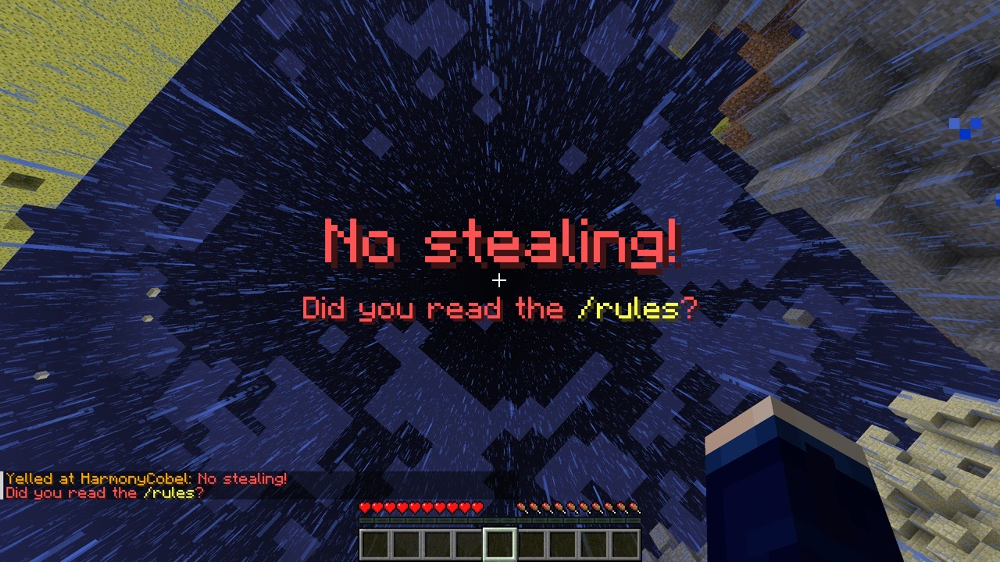

# AdminToolbox

Effective Minecraft moderation tools designed to prevent cheating, maintaining staff integrity and community trust.

**AdminToolbox natively supports [Folia][folia].**

## Features & Commands

### Spectate

`/spectate`, `/admin`, `/target`

Spectate at current location and enter admin mode. In admin mode, the player's inventory is cleared and restored when
they exit admin mode.

While spectating, the player can use the command again to exit admin mode. The player will be teleported back to their
original location, placed back into survival mode, and their original inventory will be restored.

#### Target Locations

- `/target` - Enter admin mode at current location
- `/target <player>` - Enter admin mode at a specified player's location
- `/target <x> <y> <z> [world]` - Enter admin mode at specific coordinates
- `/target <x> <z> [world]` - Enter admin mode at specific coordinates (uses the highest Y level at that location)

#### Targeting Spawn

`/spawn`, `/targetspawn`

- `/spawn` - Enter admin mode at the current world's spawn point
- `/spawn <world>` - Enter admin mode at the provided world's spawn point

### Report System

- `/report <reason>` — Players send a report with their current location and a timestamp. Admins receive a broadcast where the coordinates are clickable to spectate in admin mode.
- `/reports [page]` — View open reports (5 per page). Each entry shows player, coords, and world. Hovering shows the reason, time, and the report ID. The coords are clickable to spectate in admin mode, and an inline `[Resolve]` button lets admins resolve the report.
- `/reports resolve <id>` — Resolve by ID (or click the inline `[Resolve]` button).

Notes:
- Cooldown: players must wait 5 minutes between `/report` submissions.
- Permission: `admintoolbox.reports` is required to view/resolve reports.

#### Navigation

- `/back` - Move to previous location in teleport history
- `/forward` - Move to next location in teleport history

### Reveal

`/reveal`, `/show`

While in admin mode, running this command places the admin into survival mode at their current location. This makes the admin visible to players during confrontations while maintaining:

- Empty inventory
- Immunity to damage
- No mob targeting

### Yell

`/yell <player> <message>`

Forcibly displays a large red title on the targeted player's screen.
Use the pipe character (`|`) to separate title and subtitle: `title | subtitle`.

Legacy ampersand [color codes] are supported. (i.e. `Don't steal! | Please reread the &e/rules&r.`)

### Freeze

`/freeze <player>`

Stop a player from moving around, forcing them to stay in-place. Primarily useful during confrontations.

Frozen players:

- can still look around
- can still fall (useful if frozen in midair)
- cannot place or break blocks
- cannot take any damage
- cannot hurt other entities (including players)

To unfreeze a player, use `/unfreeze <player>`

### Streamer Mode

`/streamermode <duration>`, `/pausealerts <duration>`

Allows players to temporarily disable certain permissions (i.e. those that give them staff-only alerts), intended for
screen sharing or live-streaming gameplay.

**New in version 1.2.0.**

## Permissions

| Permission                            | Command                       | Description                                                                                                                                         |
|---------------------------------------|-------------------------------|-----------------------------------------------------------------------------------------------------------------------------------------------------|
| `admintoolbox.target`                 | `/admin`, `/target`           | Spectate at current location                                                                                                                        |
| `admintoolbox.target.player`          | `/target <player>`            | Spectate at a player's location                                                                                                                     |
| `admintoolbox.target.location`        | `/target <x> [y] <z> [world]` | Spectate at provided coordinates                                                                                                                    |
| `admintoolbox.reveal`                 | `/reveal`                     | Reveal while spectating in admin mode                                                                                                               |
| `admintoolbox.yell`                   | `/yell`                       | Show titles to other players                                                                                                                        |
| `admintoolbox.freeze`                 | `/freeze`                     | Freeze and unfreeze players                                                                                                                         |
| `admintoolbox.reports`                | `/reports`                    | View and manage player reports                                                                                                                      |
| `admintoolbox.spawn`                  | `/spawn`                      | Spectate at current world spawn                                                                                                                     |
| `admintoolbox.spawn.all`              | `/spawn [world]`              | Spectate at all world spawns                                                                                                                        |
| `admintoolbox.broadcast.receive`      |                               | Receive alerts about other admins' actions                                                                                                          |
| `admintoolbox.broadcast.exempt`       |                               | Admin actions will not alert others who can receive them                                                                                            |
| `admintoolbox.admin`                  |                               | Access to core AdminToolbox features. (**Deprecated**: Only for backward compatibility. This permission will be removed in the next major version.) |
| `admintoolbox.streamermode`           | `/streamermode`               | Enter/exit Streamer Mode, revoking certain permissions.                                                                                             |
| `admintoolbox.streamermode.unlimited` |                               | Bypass the maximum Streamer Mode duration set in config.yml.                                                                                        |

## Integrations

- **[BlueMap](https://bluemap.bluecolored.de):**
  On servers with BlueMap, the plugin will hide admins who are [revealed](#reveal) from the map.

[folia]: https://papermc.io/software/folia
[color codes]: https://minecraft.wiki/w/Formatting_codes
